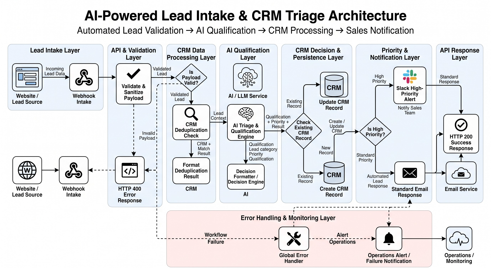

# Enterprise AI Lead Intake & Automated Triage Pipeline

An end-to-end event-driven lead qualification and CRM orchestration pipeline. Inbound submissions captured via Google Forms are sanitized, deduplicated, enriched, and qualified via an LLM (Groq Llama 3). The pipeline automatically creates/updates records in HubSpot, alerts internal teams via Slack, and dispatches dynamic, personalized outreach via Gmail.


## 🏛️ Architecture & Data Flow


## 🏗️ Architecture & Data Flow

```text
[ Google Form ] (User Inbound Submission)
       │
       ▼ (HTTP POST / onFormSubmit)
[ Google Apps Script (GAS) ]
       │
       ▼ (JSON Payload via Webhook)
[ Webhook Intake Node (n8n) ]
       │
       ▼
[ Validate & Sanitize Payload ]
       ├──▶ (Invalid Schema: Missing Email/Required Fields) ──▶ [ Return 400 Bad Request ]
       │
       ▼ (Valid Payload)
[ HubSpot CRM Deduplication Check ] (Search Contact by Email)
       │
       ▼
[ Format Dedup Result ]
       │
       ▼
[ AI Triage & Qualification Engine (Groq / LLaMA 3) ]
       │ (Evaluates: Priority, Sentiment, Intent Score, Contextual Email Draft)
       ▼
[ Merge & Decision Engine ] (Combines Lead Data + CRM Context + AI Output)
       │
       ▼
[ Check Existing Record (IF Node) ]
       ├──▶ (Contact Exists)     ──▶ [ Update CRM Record (HubSpot) ]
       └──▶ (New Lead / Missing) ──▶ [ Create CRM Record (HubSpot) ]
       │
       ▼
[ Is High Priority? (IF Node) ]
       ├──▶ (TRUE - Priority Lead)
       │       │
       │       ├──▶ [ Slack High-Priority Alert ] (Notifies #sales-team)
       │       │
       │       └──▶ [ Dynamic Gmail Dispatch ] (Sends AI-crafted response via OAuth2)
       │
       └──▶ (FALSE - Standard / Low Priority)
               │
               └──▶ [ Send Standard Email / Route to Nurture Sequence ]
       │
       ▼
[ Return 200 Success Response ]

─── [ Global Error Handler Node ] ──▶ [ Alert Ops on Failure (Slack #alerts) ]


---


1. **Intake Layer:** Inbound lead submits Google Form $\rightarrow$ Google Apps Script dispatches a structured JSON payload via HTTP POST.
2. **Orchestration Layer (n8n):** Webhook node validates and sanitizes input data against the lead schema.
3. **Intelligence Layer (Groq LLM):** Evaluates budget, intent, company size, and sentiment to classify priority (`HIGH` vs `STANDARD`) and drafts a contextualized response.
4. **CRM Sync (HubSpot API):** Upserts contact records and sets lifecycle status based on qualification score.
5. **Notification & Outreach (Slack & Gmail):** Fires real-time high-priority alerts into Slack and sends personalized AI outreach to the lead via native Gmail integration.

---

## 🚀 Setup & Installation

### 1. Prerequisites
- n8n instance (Cloud or Self-Hosted)
- Google Form with linked Apps Script
- Groq API Key
- HubSpot Private App Access Token
- Slack Incoming Webhook URL
- Authenticated Gmail OAuth2 account

### 2. n8n Workflow Import
1. In n8n, navigate to **Workflows** $\rightarrow$ **Import from File**.
2. Select `workflow/workflow.json`.
3. Configure credentials for HubSpot, Slack, Groq, and Gmail OAuth2.
4. Toggle the workflow to **Active / Published** and copy the **Production Webhook URL**.


